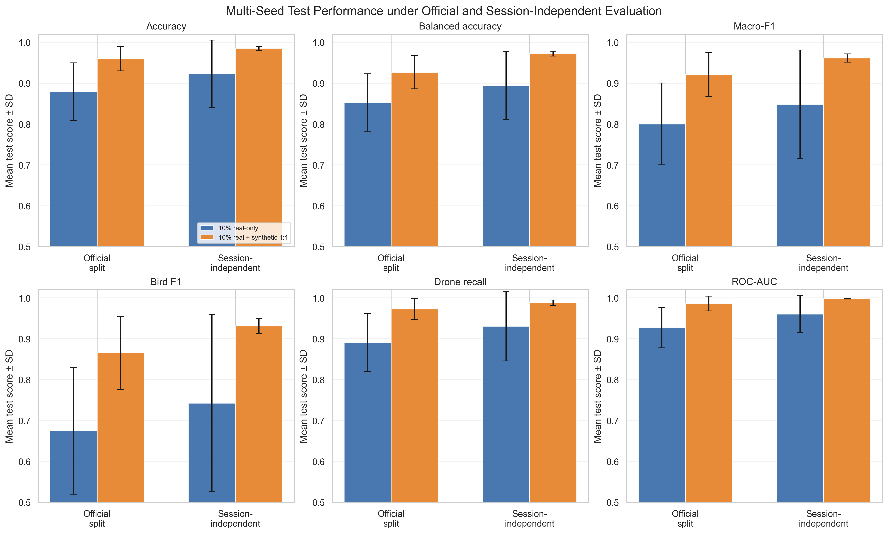

# Transformation-Based Synthetic Radar Augmentation

This repository investigates whether controlled transformation-based
synthetic radar data can improve bird–drone classification when only a
limited amount of real training data is available.

The study uses measurements collected with a 77 GHz FMCW radar. A balanced
subset representing approximately 10% of the available real training data
was augmented using feature-axis translation, amplitude scaling, contrast
adjustment, additive Gaussian noise and partial masking.



## Key results

All headline results are means across five model-training seeds.

| Evaluation protocol | Configuration | Balanced accuracy | Macro-F1 | Bird F1 |
|---|---|---:|---:|---:|
| Official segment-level split | 10% real-only | 0.8518 | 0.8003 | 0.6749 |
| Official segment-level split | 10% real + synthetic 1:1 | 0.9268 | 0.9209 | 0.8654 |
| Session-independent split | 10% real-only | 0.8941 | 0.8485 | 0.7427 |
| Session-independent split | 10% real + synthetic 1:1 | 0.9723 | 0.9615 | 0.9314 |

A 1:1 synthetic-to-real ratio was selected using validation data only.
Synthetic augmentation improved minority-class recognition, training
stability and unseen-session generalization.

## Repository structure

```text
radar-synthetic-augmentation/
├── data/
│   └── README.md
├── notebooks/
│   ├── 01_dataset_exploration.ipynb
│   ├── 02_signal_visualization.ipynb
│   ├── 03_statistical_signal_analysis.ipynb
│   ├── 04_data_preprocessing.ipynb
│   ├── 05_baseline_classification_10_percent.ipynb
│   ├── 06_real_data_learning_curve.ipynb
│   ├── 07_synthetic_data_generation_and_validation.ipynb
│   ├── 08_synthetic_augmentation_classification.ipynb
│   ├── 09_multiseed_augmentation_robustness.ipynb
│   ├── 10_synthetic_ratio_ablation.ipynb
│   ├── 11_session_independent_generalization.ipynb
│   └── 12_final_results_synthesis.ipynb
├── results/
│   ├── final_results_synthesis/
│   └── report_assets/
├── .gitignore
├── LICENSE
├── README.md
└── requirements.txt